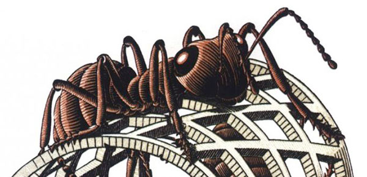

import Footer from '../../components/Footer';
import HmLink from '../../components/HmLink';
import Image from 'next/image';

<HmLink />
#### Wandering off path

This is my first post with a shiny new [metalsmith](http://www.metalsmith.io/) blogging engine that let's me vim my markdown files, do all sorts of crazy source transformations and spit out a clean, static, optimized website.

So here it is. More than just posting "something" I wanted to take this opportunity to help me refocus on **why** I started this site in the first place. I started it because I've always really liked [Sir Tim's idea](http://info.cern.ch/hypertext/WWW/TheProject.html). The problem with keeping a personal site is that you need to write something to go on the site.  This can be hard for the unfocused mind which leads to procrastination, writer's block and bad places for a writer. Sure enough a few minutes after sitting down to start the writing process I found myself web surfing for "ideas", trapped in a hyperlink wormhole.

#### A Stigmergy interaction

But somewhere in the winding link's I found myself reading a [blog article](http://bitworking.org/news/Stigmergy) by Joe Gregorio who talks about how the *Web = Stigmergy*. If your not sure what Stigmergy is, I'll use the same quote that Joe used from French biologist Pierre-Paul Grasse.

> Self-Organization in social insects often requires interactions among insects: such interactions can be direct or indirect. Direct interactions are the "obvious" interactions... Indirect interactions are more subtle: two individuals interact indirectly when one of them modifies the environment and the other responds to the new environment at a later time. Such an interaction is an example of stigmergy.

So basically, interaction through the environment. In an example he talks about how an ant uses pheremone trails to communicate a food source to other ants. He goes on to claim that *The World-Wide Web is the first stimeric communication medium for humans*.

It was very interesting and I could have kept the procrastination up much longer but felt like getting back to writing. Ok, so here it is. It's very self descriptive but I wanted to kick the tires on Metalsmith and get back into a writing mode more than actually writing something useful, however, I did get to use a lot of big new words.

<Footer />
  
