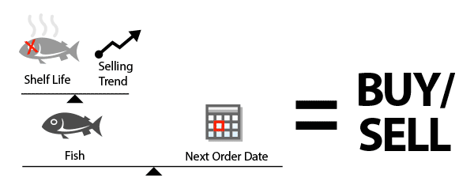

<main>
  #### *Question:*

  What could you do with lot's of anonymized purchasing data???

  Imagine a large grocery chain gave you access to the anonymized purchase history of all its customers. Your tasked with creating a user experience for the retailer to explore this data, discover insights, and apply them to make their business more profitable and their customers happy.

  > This problem was originally given to me by a company I interviewed with. Candidates where given a day to work through the problem and come up with rough sketches, wire-frames or whatever they could to convey a solution.  They never called me back so it might not have been the kind of answer they were looking for, however, I thought it a fun exercise and wanted to get some more use out of my efforts so here's what I came up with.

  #### *Answer:*

  
  Grokker is a digital tool for analyzing customer purchasing trends and better optimize inventory by intelligently measuring the connections between a grocers marketing campaigns, product pricing and brand loyalty.

  ---
  #### *Overview:*

  Grokker gives busy store managers insight into their operations data in not just quantitative but also qualitative ways.

  #### By focusing on key analysis views, managers will be able to identify buying trends and see potential inventory problems in real-time.

  Armed with this key knowledge, managers can then use Grokker to set triggers on data points and keep shelves stocked. These actions would tie in and work with existing systems to automate and optimize inventory as well as feed marketing systems with real-time data for running campaigns.

  Grokker also helps pinpoint potential items for mark down or mark up and help identify special case items like low selling items that might have strong customer loyalty letting you keep stores inventory optimized with just what your customers want.

  
  Grokker will weigh an items shelf life against its current selling trend then check that with its next scheduled order date to determine a ***buy*** or ***sell*** status on an item. Grokker makes it easy to set up a variety of *buy/sell* triggers and notifications that let managers feel like the stores whole inventory just got on *facebook*.

  ##### Inventory View
  ---
  

  Grokker's Inventory view gives a vertical list of all story items with an items line view displaying the number of days projected to be **short** or **long** of the ideal order date.

  ##### Short List View
  ---
  

  If an items projected outage date is before the next order date it could potentially run short and might need to be re-ordered sooner. Items selling slower than projected are flagged for price cuts or marketing intervention.

  ---
</main>
