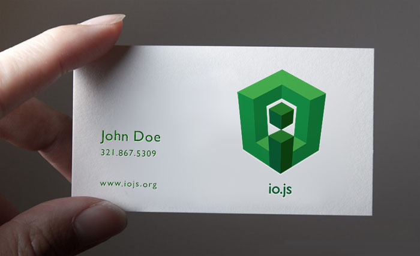

import HmLink from "../../components/HmLink.js";

<HmLink />

## io.js

#### Logo design for io.js

When some of the core [node.js](https://nodejs.org) developers branched the project earlier this year into [io.js](https://iojs.org). I thought I would pitch in the logo design frenzy with a design inspired by node's green hex and the 3D boxy look that's all the rage now days.

I don't think io.js ever got to an official logo before being merged back to the node project, but as my time is mainly spent on development, issues now it was fun to jump back to Illustrator and mess around for a while.

