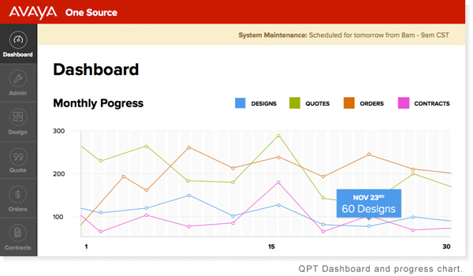

<main>
  Today I finally got to do something I've been wanting to do for a while.

  `git tag -a v1.0 -m 'QPT Ver. 1.0 Shipped'`

  And with that we pushed Avaya's first ever OAuth 2.0, Angular 1.3, single page web app.

  QPT, or **Quick Price Tool** in the expanded version helps Avaya customers quote out a mid-market networking design in 3 easy steps. If you have a *Google*, *LinkedIn* or *Facebook* account and are in the mid-market mood for a network then stop by and check it out.

  **[QPT](https://qpt.avaya.com/a1s/login/login.html)**

  

  As a general description I would describe it as a web based tool for ordering network software, hardware and other supporting services from Avaya. These *services* have some *technical* dependencies that can make the orders somewhat complex so the flow of an *order* in this system goes through four states:

    1. Design
    2. Quote pending
    3. Quote complete
    4. Ordered

  QPT takes the user through the order process flow up till *Ordered* state and lets users see an overview of quotes and orders they have put through the system.

  > While QPT is open to OAuth2 users the main use case for QPT is an Avaya resell partner who would put **N** number of orders through for **N** number of end customers.

  Some of the  UX concerns where centered on creating quicker designs (compared to older quote systems), a clean modern interface that works in evergreen browsers, and easing the subject matter knowledge needed to build out a *mid*market network design.

  Technically this came at a time when the company had just dropped continued support for IE8 browsers. They had also just started moving away from thinking like a big monolithic style IT development shop and micro-services were all the buzz. They, also, were transitioning from using Microsoft to Oracle/Java middle and back ends and never even thought about client side restful style applications.

  The project was conceived in our department so all requirements came mainly from us where my roll in the project was to work with our UX team to conceive and engineer the initial application, hire a team of web/Java developers, then lead development efforts to our stated goals.

  The project had plenty of challenges and lessons learned that I hope someday to share; but I soon found myself managing 5 more front-end focused web applications. So for the time being it might be less blog posts writing and more focus on dev-ops.
</main>
